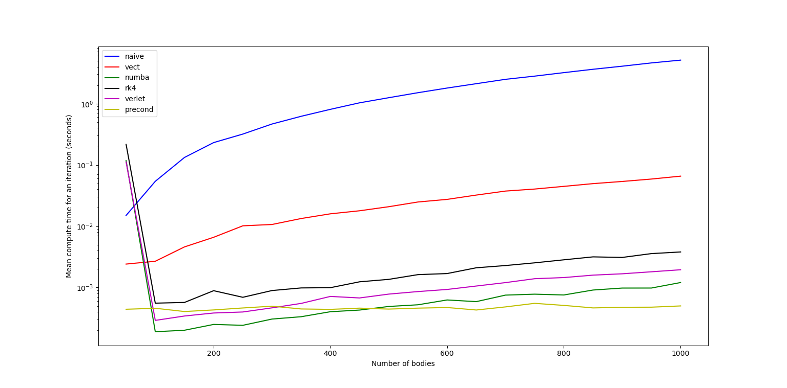

# Projet Python : simulation de Galaxies

## Auteurs:
- Bleuler Alexandre
- Dohemeto Bonaventure
- Sakiye Florient

## Introduction

Le but de ce projet est de simuler ## un problème à $N$ corps mûs par la gravité, ici une galaxie. 
L'objectif principal est d'utiliser diverses méthodes pour ce faire et de comparer leurs performances. Les packages suivants sont nécessaires  pour exécuter l'ensemble des fichiers:
- `numpy`;
- `matplotlib`;
- `numba`;
- `PyOpenGL`;
- `PySDL2`.

## Présentations des versions

### La version naïve

La première version est une version simple utilisant un schéma d'Euler explicite pour le calcul des accélérations et les mécanismes basiques de Python sans souci d'optimisation. Elle est codée dans le fichier `Versions/v_naive.py`. 

### La version vectorisée

Afin d'améliorer la version naïve, une vectorisation des calculs d'accélération a notamment été réalisée. Elle est codée dans le fichier `Versions/v_vect.py`.

### La version avec `numba`

Une autre option pour améliorer les performances est d'utilisé le package `numba` au lieu de vectoriser les calculs. Cette version est codée dans le fichier `Versions/v_numba.py`.

### La version avec un schéma de RK4

Il est également possible de changer le schéma d'intégration afin d'améliorer l'approximation faire sur l'accélération. Ceci est réalisé dans le fichier `Versions/v_rk4.py`.

### La version avec un schéma de Verlet

Les schémas d'Euler et RK4 ne préserve pas l'énergie du système, ce qui déstabilise l'orbite des étoiles au fur et à mesure des itérations. Le schéma de Verlet peut alors être utilisé pour pallier ce problème, comme cela a été fait dans le ficheir `Versions/v_verlet.py`.

### La version avec préconditionnement par grille

Pour améliorer davantage les performances, un préconditionnement par grille peut-être réalisé :
- l'espace est découpé en boîtes;
- la masse totale des corps situé dans chaque boîte est calculé de même que le centre de gravité associé;
- si un corps donné est suffisamment loin d'une boîte donnée, le calcul de l'accélération des autre corps dans la boîte est approximé raisonnablement par l'attraction du corps virtuel associé à la masse totale et le centre de gravité de la boîte. 

Le fichier `Versions/v_precond.py` implémente cela.

## Performances

### Méthode utilisée pour les mesures

La philosophie pour comparer les versions est la suivante :
- chaque version calcule l'évolution de la galaxie sur un nombre d'itérations donné et une gamme de nombre de corps;
- pour chaque version et chaque nombre de corps, le temps moyen pour réaliser une itération est calculé;
- pour chaque version et chaque nombre d'étoiles, le temps moyen d'itération est enregistré afin de pouvoir être utilisé ultérieurement pour réaliser les comparaisons entre versions.

Pour ce faire, le fichier `speedtests.py` a été utilisé. Il permet de choisir aisément la version ainsi que le pas de temps utilisé, le nombre d'itérations à faire pour chaque galaxie et réalise ceci pour les galaxies enregistrées dans `DATA/galaxies_data/` (de 50 à 1000 corps par pas de 50). Les mesures de temps sont alors enregistrées dans `DATA/speedtests_data/` afin de pouvoir être réutilisées facilement. 

### Les résultats

Les mesures de performances ont été réalisés avec les paramètre suivants :
- des galaxies de 50 à 1000 corps avec un pas de 50 ;
- un pas de temps de 0.01;
- 10 itérations par galaxie;
- pour la version avec préconditionnement par grille, un découpage de 20x20x1 a été utilisé. 
L'ensemble des résultats sont résumés sur le graphique suivant (échelle logarithmique en ordonnée) :

<figure>
    
</figure>
